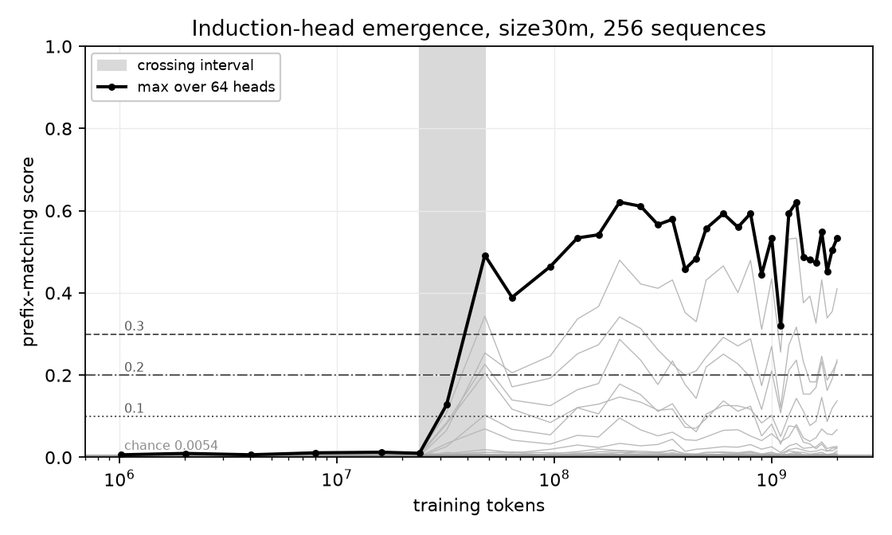

# small-lm-lab

Locating induction-head emergence in from-scratch language model pretraining, on a pre-registered checkpoint grid.

## Model

| | |
|---|---|
| Architecture | decoder-only transformer, pre-norm RMSNorm, RoPE, SwiGLU, no biases, tied embeddings |
| Context | 512 tokens |
| Headline size | 34,087,424 parameters (`d_model` 512, 8 layers, 8 heads) |
| Optional sizes | 60M, 120M |
| Vocabulary | byte-level BPE, 16,384 |
| Optimizer batch | 16,384 tokens/step, held exact under gradient accumulation |

## Data

| Corpus | License | Train tokens |
|---|---|---|
| TinyStories V2 (GPT-4) | CDLA-Sharing-1.0 | 531,101,051 |
| FineWeb-Edu (sample-10BT) | ODC-By 1.0 | 167,948,480 |
| Web extension | ODC-By 1.0 | 2,610,318,560 |

Mix 70/30 stories to web. Web train stream with extension: 2,778,267,040 tokens. Document-level splits, assigned before tokenization.

200-gram contamination check, with positive control. Pre-decontamination: 9/128 validation, 7/128 test. Post: 0/128, 0/128. See `docs/DATA.md`, `docs/DECONTAMINATION.md`.

## Checkpoint grid

34 checkpoints, 1,000,000 to 2,000,000,000 tokens, front-loaded. Fixed in `configs/stage_a_checkpoints.json`.

## Pre-registration

- Registered decisions, criteria, thresholds, and emergence-location predictions, condensed: `docs/PROTOCOL.md`.
- Registration written before training and before the measuring harness existed, amended only by dated entries. Full registered text retained offline.
- Every number traces to a pipeline output.
- Abandonment criteria registered alongside success criteria.
- Amendment history: `docs/METHODOLOGY.md`.

## Results

Peak learning rate, selected by held-out TinyStories perplexity at 40,009,728 tokens, 1000-resample bootstrap:

| Peak LR | TinyStories val perplexity | 95% interval |
|---|---|---|
| 6e-4 | 5.2189 | 5.1917 to 5.2448 |
| 1.2e-3 | 5.0160 | 4.9908 to 5.0400 |
| 2.4e-3 | 6.1681 | 6.1341 to 6.1996 |

Record: `analysis/ablations/lr_winner.json`. Per-run output: `analysis/ablations/valppl_abl_lr*.json`.

### Cross-backend validation gate

Registered tolerance failed: end difference 0.061059 against 0.02 bound, mean difference steps 400-500 of 0.043621 against 0.015. Five-seed control: all ten same-configuration pairs also fail, smallest end difference 0.095183 (4.76x bound). TF32 explanation refuted at 5.75e-07 relative Frobenius error against float64, threshold 1e-05. Derived tolerance 1.246862 exceeds registered abandonment bound 0.25, so no replacement gate adopted. Backend fidelity established instead by identical-weight comparison: 3.5e-06 maximum absolute logit difference. `docs/GATE_FINDING.md`.

### Positive controls

- Contamination check paired with planted-contamination control.
- Induction-presence statistical test: on random-init models, gap-to-standard-error rose 0.61 (8 sequences) to 5.31 (1024), gate opened on 47.5% of 40 random-init models at the registered 256. Demoted to necessary-not-sufficient. `docs/PROTOCOL.md`, amendment 2026-07-17.

### Stage A result



size30m, seed 1, 2,000,011,264 tokens, 34 of 34 registered checkpoints. Prefix-matching at the registered 256 sequences.

| Quantity | Value |
|---|---|
| Max prefix-matching, 24,002,560 tokens | 0.0100 |
| Max prefix-matching, 48,005,120 tokens | 0.4918 |
| Crossing interval (0.1 to 0.3) | 24,002,560 to 48,005,120 tokens |
| Crossing time, 1,000-resample bootstrap | 48,005,120; both percentile bounds at the same grid point |
| Heads above 0.2, final checkpoint | 4: L4H4, L4H7, L5H1, L6H0 |
| Abruptness verdict | INDETERMINATE AT THIS RESOLUTION |
| Grid intervals spanned (G) | 2 (ABRUPT at 3 or fewer) |
| Share of FineWeb-Edu val-loss improvement in interval (F) | 0.1357 (ABRUPT at 0.10 or less, GRADUAL at 0.30 or more) |
| Registered loss bump | none, either domain |

Validation loss: `analysis/emergence/final/figures/loss.png`.

### Replication and depth controls

| Run | Params | Tokens | Crossing end | Bootstrap crossing | Peak max prefix-matching | Heads above 0.2 at end |
|---|---:|---:|---:|---|---:|---|
| size30m, seed 1 | 34,087,424 | 2,000,011,264 | 48,005,120 | 48,005,120 to 48,005,120 | 0.6212 | L4H4, L4H7, L5H1, L6H0 |
| size30m, seed 2 | 34,087,424 | 64,012,288 | 64,012,288 | 64,012,288 to 64,012,288 | 0.3434 | L5H5, L5H7 |
| 1 layer | 11,601,408 | 64,012,288 | none | 1,000 of 1,000 resamples uncrossed | 0.0064 | none |
| 2 layers, attention only | 10,487,296 | 64,012,288 | none | 1,000 of 1,000 resamples uncrossed | 0.0132 | none |

Seed-to-seed crossing ratio 1.33; registered replication bound 2x.

### Causal battery

Joint per-position mean ablation of all heads above 0.2. Copying: 512 sequences. ICL: 2,048 FineWeb-Edu validation windows. 1,000-resample 95% intervals. Controls: equal-count non-induction heads, same layers.

| Checkpoint | Heads ablated | Copying exact-match change, induction heads | Copying exact-match change, controls | FineWeb-Edu ICL damage (nats), induction / controls |
|---|---:|---|---|---|
| 48,005,120 | 5 | -0.00684 [-0.00752, -0.00618], baseline 0.00701 | +0.00011 [-0.00017, +0.00034] | 0.0914 / 0.0030 |
| 64,012,288 | 2 | -0.00215 [-0.00255, -0.00174] | +0.00002 [-0.00006, +0.00009] | 0.0286 / 0.0015 |
| 2,000,011,264 | 4 | -0.11665 [-0.12179, -0.11183] | -0.01779 [-0.01910, -0.01656] | 0.0853 / 0.0079 |

Global-mean ablation (sensitivity check): intervals non-overlapping between induction and control heads at all three checkpoints; point values in `stage_a_causal_battery.json`.

Activation patching, 256 sequences, recovered fraction of clean-minus-corrupted logit-difference gap:

| Checkpoint | Induction heads | Control heads |
|---|---|---|
| 48,005,120 | 5.7% to 35.3% | 0.0% to 0.3% |
| 64,012,288 | 7.5% to 40.2% | 0.0% to 0.2% |
| 2,000,011,264 | 10.6% to 22.6% | 0.0% to 5.5% (L6H1) |

Causal checkpoints 16M, 24M and 32M: no head above 0.2, battery not run.

### Registered predictions

6 held, 2 failed, 0 unscored. `analysis/emergence/final/stage_a_prediction_scorecard.json`.

| ID | Prediction | Measured | Verdict |
|---|---|---|---|
| P1 (primary) | crossing closes at or below 200M tokens; point 48M | 48,005,120 | held, point hit |
| P2 | at least one head above 0.2 at final; point 1-4 heads, layers 2-6 | 4 heads, layers 4-6 | held |
| P3 | at most 3 grid points inside crossing | 1 | held |
| P4 | previous-token head above 0.3 before crossing | 0.6228 at 24,002,560 | held |
| P5 | FineWeb-Edu ICL falls at least 0.05 nats across crossing; steepest step within one grid step | 0.0408 nats; steepest step 6 grid points later | failed |
| P6 | copying clears chance by 200M tokens | 2,015,232 | held |
| P7 | crossing head OV copying score above 0.5 at or one step before crossing | L4H7 -0.049 at crossing, 0.338 one step before; L5H1 -0.381 | failed |
| P8 | untrained model stays at chance | max prefix-matching 0.0055; 0 heads above 0.2; copying interval does not clear chance | held |

### Final checkpoint evaluation

| Split | TinyStories perplexity | FineWeb-Edu perplexity | TinyStories ICL | FineWeb-Edu ICL |
|---|---:|---:|---:|---:|
| validation | 3.791 | 52.289 | -0.0691 | -0.1705 |
| test | 3.777 | 53.225 | -0.0780 | -0.1673 |

| Measure | Value |
|---|---|
| BLiMP, mean of 10 registered paradigms | 0.8021 (9 above 0.75; `npi_present_1` 0.475) |
| Copying exact-match | 0.1173 [0.1124, 0.1224]; chance 0.000061 |
| Pre/mid/post causal anchors | not selectable: no registered three-checkpoint plateau after the rise |

### 5-gram ICL null

Interpolated modified Kneser-Ney, order 5, KenLM, full train split per domain, same validation windows and late-minus-early statistic.

| Domain | Windows | 5-gram ICL [95%] | Neural ICL |
|---|---:|---|---:|
| TinyStories | 9,827 | +0.01345 [-0.00587, +0.03026] | -0.0691 |
| FineWeb-Edu | 9,801 | -0.00122 [-0.01864, +0.01697] | -0.1705 |

KenLM pruning `0 1 1 2 2` (not fixed by the protocol).

Artifacts: `analysis/emergence/final/`, `analysis/evaluation/`.

## Throughput and cost

Stage A: 2e9 tokens, 122,071 steps. RTX 3070, float32, from `analysis/desktop_bench/train_log_mb{2,4,8}.jsonl`:

| Micro-batch | Accum | Tok/s | Train peak VRAM | Val peak VRAM |
|---|---|---|---|---|
| 2 | 16 | 28,165 | 1.14 GB | 2.72 GB |
| 4 | 8 | 30,506 | 1.72 GB | 2.73 GB |
| 8 | 4 | 31,094 | 2.81 GB | 2.81 GB |

Effective 29,840 tok/s at micro-batch 4: Stage A about 18.6 hours, full 5e9-token budget about 46.5 hours. Apple M4 via MLX: 3,785 tok/s, Stage A about six days. Micro-batch 2/4/8 agree on loss to about 1e-7.

Disk, under `SMALL_LM_LAB_BULK_ROOT`:

| Artifact | Size |
|---|---|
| Tokenized corpus, base splits | 1.44 GB |
| Tokenized corpus, web extension | 5.22 GB |
| Stage A checkpoints (34 bf16) | 2.89 GB |
| Resume state | 442 MB |

Web extension stages ~11.2 GB raw before tokenization, deleted after. Peak requirement ~20 GB.

## Layout

```
src/small_lm_lab/    model (torch and mlx), training, evaluation, interpretability
scripts/             numbered entry points, run in order
configs/             checkpoint grid
docs/                pre-registration, data provenance, findings
tests/               correctness and regression suite
analysis/            measured outputs
```

Order: throughput pilot (01), download and tokenize (02-05), evaluate (06), train
(07), causal battery (08), schedule runner (09), copying probe (10), curve
comparison (11), contamination (12), decontamination (13), backend diagnostics
(15-17), emergence sweep (19), vocabulary coverage (20), validation-loss curve
(21), abruptness verdict (22), figures (23), prediction scorecard (24), anchor
selection (25), 5-gram null (26), and replication/control summary (27).
`scripts/smoke_gate.py` runs downstream stages against a tiny model first.

## Running

Python 3.12 and [uv](https://docs.astral.sh/uv/).

```bash
uv sync
uv run pytest
```

```bash
uv run python scripts/07_train.py \
  --size size30m --framework torch --device cuda --torch-precision fp32 \
  --lr 1.2e-3 --lr-schedule constant --warmup-tokens 4000000 \
  --tokens 2e9 --seed 1 --micro-batch 4 \
  --checkpoint-schedule configs/stage_a_checkpoints.json \
  --run-name size30m_staged_seed1
```

Replication and controls: same command with `--tokens 6.4e7 --checkpoint-schedule configs/control_checkpoints.json` and

| Run | Flags |
|---|---|
| size30m, seed 2 | `--seed 2 --run-name size30m_replication_seed2` |
| 1 layer | `--size control_depth1 --run-name control_depth1_seed1` |
| 2 layers, attention only | `--size control_attn2 --run-name control_attn2_seed1` |

Analysis: scripts 19 to 27 in order, against the checkpoint directories above.

## Status

| Item | State |
|---|---|
| Stage A, size30m to 2B tokens, 34 checkpoints | done |
| Second seed, 1-layer and 2-layer attention-only controls, to 64M tokens | done |
| Causal battery, final evaluation, prediction scorecard, 5-gram null | done |
| Stage B (continue past 2B in 500M segments, 5B cap) | not run; registered stop rule (plateau of 3 checkpoints within 3 sigma = 0.0065 of running max, plus 20% margin) not met through 2B; run stopped at 2B |
| size60m, size120m | not run; optional after 2026-07-21 rescope |
| Checkpoints and tokenized corpus | not published |

## License

MIT (`LICENSE`). Corpora are not redistributed. `data/tokenizer/tokenizer.json` carries the source datasets' terms in addition to MIT; see `NOTICE`.
